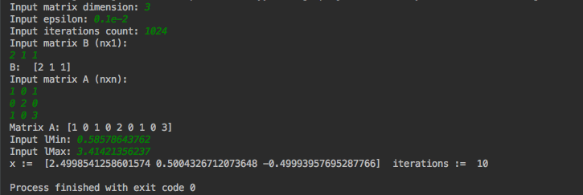

# Chebyshev Iteration
Implementation of Chebyshev iteration method for determining the solutions of a system of linear equations.

#### Example 1: Using library

```cgo
package main

import (
	"math"
	"chebyshev-iteration/chebyshev_iteration"
	"fmt"
)

func main() {
	n := 3
	eps := 0.1e-2
	gamma1 := 2 - math.Sqrt(2)
	gamma2 := 2 + math.Sqrt(2)
	b := []float64{2, 1, 1}
	a := []float64{1, 0, 1, 0, 2, 0, 1, 0, 3}

	chebyshev_iteration.Init(n, eps,512,a,b,gamma1,gamma2)

	result := chebyshev_iteration.ChebyshevIteration()

	fmt.Println("x := ", result.X, " iterations := ", result.Iterations)
}
```

Response:
```
x :=  [2.5 0.5003698918625162 -0.5]  iterations :=  24
```

#### Example 2: Using console client



#### References

1. https://en.wikipedia.org/wiki/Chebyshev_iteration
2. https://www.encyclopediaofmath.org/index.php/Chebyshev_iteration_method
3. http://www.sam.math.ethz.ch/~mhg/pub/Cheby-02ParComp.pdf
4. http://www.netlib.org/templates/templates.pdf